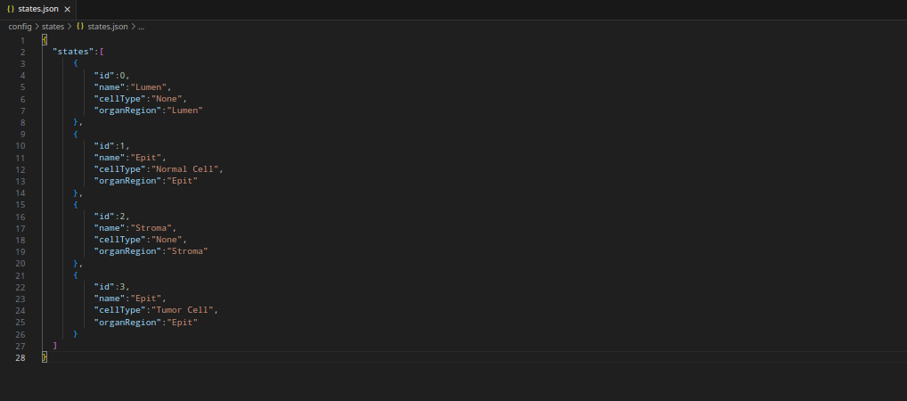
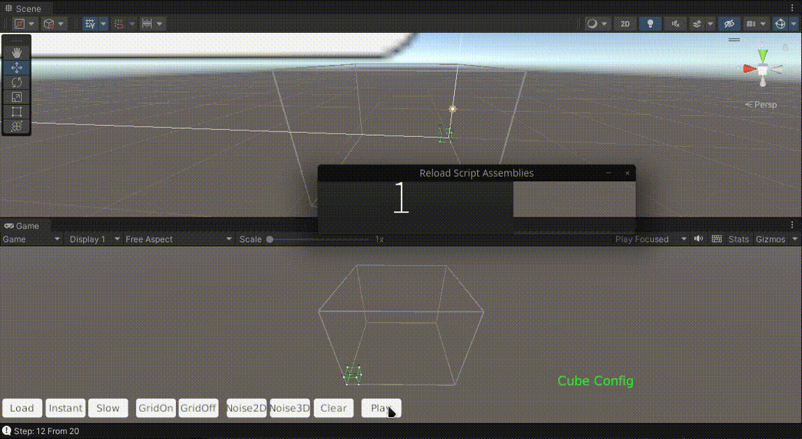
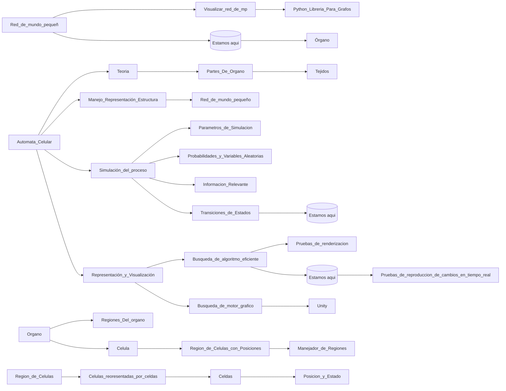

# Automata Celular para la simulacion del crecimiento de un tumor en 3D
Autor: Carlos Carret MIranda @Krtucho
## ¿Qué es el cáncer?
- Es una enfermedad que se caracteriza por el crecimiento descontrolado de células anormales en el cuerpo.
- Estas células pueden formar una masa llamada tumor.
- No todos los tumores son cancerosos; los tumores benignos no se propagan a otras partes del cuerpo y no son una amenaza para la vida.
- Sin embargo, los tumores malignos pueden invadir los tejidos cercanos y diseminarse a otras partes del cuerpo a través del sistema sanguíneo y linfático

## ¿Qué herramienta nos propusimos desarrollar para ayudar a la lucha contra el cáncer?
Simulación del crecimiento de un tumor en órganos del cuerpo humano, surgiendo en el tejido epitelial, conocidos como carcinomas.

## Autómata Celular
- Un autómata celular es un modelo matemático para un sistema dinámico que evoluciona en pasos discretos. 
- Consiste en una cuadrícula regular de celdas, cada una en uno de un número finito de estados. 
- Cada celda se actualiza en función de un conjunto de reglas fijas que determinan su nuevo estado en términos del estado actual de la celda y los estados de las celdas vecinas. 
- Los autómatas celulares son utilizados para modelar sistemas naturales que pueden ser descritos como una colección masiva de objetos simples que interactúan localmente unos con otros. 
- Son utilizados en diversas áreas como la física, la biología teórica y el modelado de microestructuras.

## Beneficios del uso de un autómata celular para simular el crecimiento de un tumor en pacientes con cáncer:

- Modelado del crecimiento tumoral: Un autómata celular puede ser utilizado para simular la expansión y proliferación de células cancerosas en un entorno virtual. Cada célula en el autómata celular representa una célula cancerosa y se actualiza en función de reglas específicas que determinan su comportamiento y crecimiento. Esto puede ayudar a comprender mejor cómo se desarrolla y se propaga el tumor en diferentes escenarios.
 - Evaluación de tratamientos: Al simular el crecimiento del tumor con un autómata celular, es posible evaluar diferentes estrategias de tratamiento y su efectividad en la reducción o control del tumor. Por ejemplo, se pueden simular diferentes terapias, como la quimioterapia o la radioterapia, y observar cómo afectan el crecimiento y la propagación del tumor en el modelo.
 - Optimización de terapias personalizadas: Un autómata celular puede ser utilizado para explorar diferentes combinaciones de tratamientos y encontrar la mejor estrategia personalizada para un paciente específico. Al ajustar las reglas del autómata celular según las características del paciente y el tipo de tumor, se pueden identificar las terapias más efectivas para ese caso particular.
 - Investigación de resistencia a los tratamientos: Los autómatas celulares también pueden ayudar a investigar y comprender la resistencia a los tratamientos del cáncer. Al simular la evolución del tumor en presencia de tratamientos específicos, es posible identificar las características y los mecanismos que pueden llevar a la resistencia, lo que podría guiar el desarrollo de enfoques terapéuticos más efectivos.

## Problemas
### ¿Cómo manejar grandes cantidades de células y sus conexiones?
### ¿Cómo simular un proceso tan costoso y con tantos parámetros?
### ¿Cómo representar estas células y sus conexiones para analizarlas?
### ¿Cómo representar la estructura del tumor?

## Sí, son muchos problemas.

### Dando solución a los problemas

#### Manejar mucha información.
- Uso de archivos .json para manejar la información y los parámetros a asignar.
- Uso de lenguajes de programación rápidos y eficientes como C# para el manejo de memoria y guardado de gran cantidad de información en memoria o disco.
- Empleo de matrices, grafos, estructuras similares.
- Empleo de estructuras que manejen búsquedas rápidas como diccionarios o tablas de hash.

#### Simulación
- Se lleva a cabo la implementación de un motor eficiente que nos permita simular cualquier tumor que se origine en el tejido epitelial de cualquier órgano.
- Para esto se lleva a cabo el análisis región por región del órgano que se esté analizando.
- El rendimiento, la velocidad y el alcance dependerán de los recursos con los que cuente el ordenador en el que se esté ejecutando la simulación.

#### Visualizar estructura de órganos, tejidos, células y conexiones.

Python y Streamlit. Se utilizan librerías para trabajar con grafos y representarlos en 3D, gravis, networkx.

#Visualización de las células y las conexiones entre las mismas

#### Representacion del tumor
Unity
- Se implementa un algoritmo para representar cada cara exterior del tumor. 
- Tener en cuenta que al disponer de tantos vértices se dificulta la representación del tumor, así que una forma eficiente de representar esto es mediante algunas técnicas para el modelado en 3D.

Marching Cubes - https://people.eecs.berkeley.edu/~jrs/meshpapers/LorensenCline.pdf

# Renderización del tumor.

## ¿Cuánto hemos avanzado hasta el momento?
- Carga y utilización de parámetros para la simulación. 
- Tenemos implementado el motor para simular el crecimiento de un tumor en órganos de pequeña extensión.
- Visualización y análisis del grafo de células con sus conexiones. 
- Visualización del tamaño que tomará el tumor a lo largo de la simulación.

## ¿Cuál será nuestro enfoque en las siguientes etapas? 
Mejorar todo lo anterior y además: 
- Leer mucha información médica. 
- Implementar cambios entre estados siguiendo los detalles encontrados en la literatura.
- Implementar algoritmos eficientes para procesar grandes cantidades de células y sus conexiones, estamos hablando de millones de ambas. 
- En un futuro, agregar Inteligencia Artificial y técnicas de Machine Learning para obtener mejores aproximaciones a la realidad.

# Roadmap (Hoja de Ruta)

## Descripcion
El proyecto se divide en 3 ramas principales. La rama de la estructura de nuestro automata celular, la rama de la simulacion del proceso en general del crecimiento del automata y por ultimo la rama referente a todo el proceso de visualizacion del proceso, la parte grafica. Se agrega una rama referente a toda la teoria detras de nuestro modelo.

Si se sigue la trayectoria de cada una de las 3 ramas se podra notar que se encuentra un indicador de donde se esta investigando actualmente (representado con el texto Estamos aqui).
### Manejo - Representación - Estructura
Se comienza Creando Un Organo principal y Uno o mas Organos secundarios. Cada uno de estos organos tendra cierta esctura, la cual sera una red de mundo pequenno para representar las celulas y sus conexiones.

### Simulación del proceso
Contiene todo lo relacionado con la transicion de estados y aplicacion de los parametros de simulacion y variables aleatorias. Es el nucleo del proyecto y se centra en lograr una aproximacion a la realidad en cuanto al desarrollo y crecimiento del tumor.

Se comienza definiendo ciertas clases y estructuras para representar y trabajar con:
- Parametros_de_Simulacion
- Probabilidades_y_Variables_Aleatorias
- Informacion_Relevante: Informacion sobre los alrededores de las celulas.
- Transiciones_de_Estados

Luego se comenzara a desallorrar lo relacionado con la transicion de estados. Recalcar que una transicion entre un estado y otro tendra en cuenta parametros, probabilidades y variables aleatorias y la informacion relevante.
### Representación y Visualización
Se utiliza como herramienta el framework Unity, en C#. Se mapeara la region comprendida por el tumor en un instante de tiempo. Mas adelante se pretende mapear toda la simulacion del proceso en tiempo real.

Destacar que se prevee que el proyecto se encuentre en constantes cambios. Asi que la informacion que se encuentra actualmente puede que cambio parcialmente.

## Agradecimientos:
- A mi tutor Reynaldo.
- A los creadores de semejante genialidad: https://github.com/dionisio35/CausalFlow/ @lauolivia y @dionisio35
- A la creadora de la implementacion del algoritmo de Marching Cubes: https://github.com/omarvision/how-todo-marching-cubes @omarvision