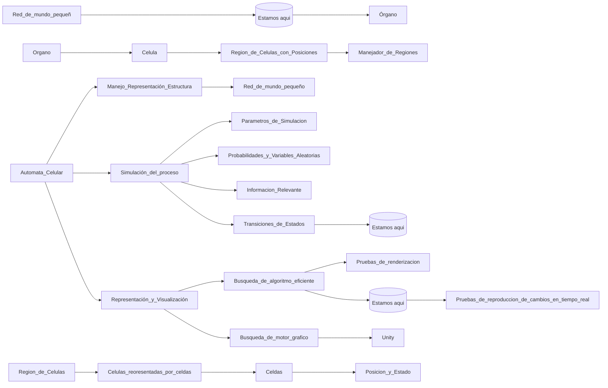

# Automata Celular para la simulacion del crecimiento de un tumor en 3D

# Roadmap (Hoja de Ruta)

## Descripcion
El proyecto se divide en 3 ramas principales. La rama de la estructura de nuestro automata celular, la rama de la simulacion del proceso en general del crecimiento del automata y por ultimo la rama referente a todo el proceso de visualizacion del proceso, la parte grafica.

Si se sigue la trayectoria de cada una de las 3 ramas se podra notar que se encuentra un indicador de donde se esta investigando actualmente (representado con el texto Estamos aqui).
### Manejo - Representación - Estructura
Se comienza Creando Un Organo principal y Uno o mas Organos secundarios. Cada uno de estos organos tendra cierta esctura, la cual sera una red de mundo pequenno para representar las celulas y sus conexiones.

### Simulación del proceso
Contiene todo lo relacionado con la transicion de estados y aplicacion de los parametros de simulacion y variables aleatorias. Es el nucleo del proyecto y se centra en lograr una aproximacion a la realidad en cuanto al desarrollo y crecimiento del tumor.

Se comienza definiendo ciertas clases y estructuras para representar y trabajar con:
- Parametros_de_Simulacion
- Probabilidades_y_Variables_Aleatorias
- Informacion_Relevante: Informacion sobre los alrededores de las celulas.
- Transiciones_de_Estados

Luego se comenzara a desallorrar lo relacionado con la transicion de estados. Recalcar que una transicion entre un estado y otro tendra en cuenta parametros, probabilidades y variables aleatorias y la informacion relevante.
### Representación y Visualización
Se utiliza como herramienta el framework Unity, en C#. Se mapeara la region comprendida por el tumor en un instante de tiempo. Mas adelante se pretende mapear toda la simulacion del proceso en tiempo real.

Destacar que se prevee que el proyecto se encuentre en constantes cambios. Asi que la informacion que se encuentra actualmente puede que cambio parcialmente.